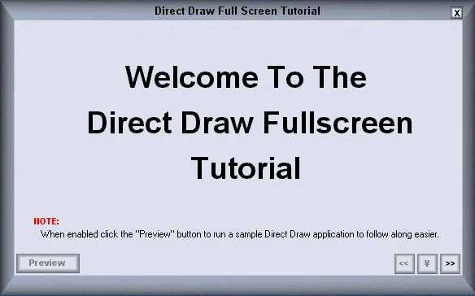



## Direct Draw Full Screen Tutorial And Explanation For Total Begginers \(UPDATED\)

### Description

Fixed the UI problem. Easier on the eyes.

What does DDSCL_ALLOWMODEX do?  

What does DDSD_CAPS mean?  

This will help you to understand what everything does and what everything means. It also has a built in demo showing you how to blit, draw text, and figure FPS, agian fully commented to help you understand. I want to make more of these cause it also helps me to learn but if no one likes them I wont. Please let me know what you think and maybe I'll make a bigger tutorial and do a tutorial on what you guys want, Direct3D, DirectMusic, DirectSound, etc. Due to filesize and until I get my cable modem, this one is relatively short, but VERY HELPFULL. Let me know what you think of it. Enjoy -James-
 
### More Info
 

             |
---                |---
**Submitted On**   |2002-03-25 16:48:02
**By**             |[James Dougherty](https://github.com/Planet-Source-Code/PSCIndex/blob/master/ByAuthor/james-dougherty.md)
**Level**          |Beginner
**User Rating**    |5.0 (45 globes from 9 users)
**Compatibility**  |VB 6\.0
**Category**       |[DirectX](https://github.com/Planet-Source-Code/PSCIndex/blob/master/ByCategory/directx__1-44.md)
**World**          |[Visual Basic](https://github.com/Planet-Source-Code/PSCIndex/blob/master/ByWorld/visual-basic.md)
**Archive File**   |[Direct\_Dra653063252002\.zip](https://github.com/Planet-Source-Code/james-dougherty-direct-draw-full-screen-tutorial-and-explanation-for-total-begginers-updat__1-33053/archive/master.zip)

